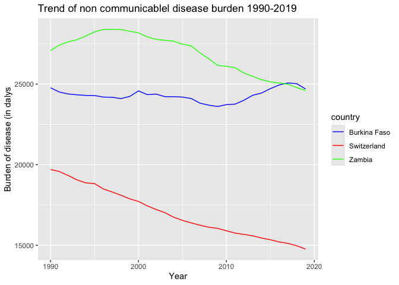

Global Disease Burden Analysis
================
LASSANE KABORE

# Introduction

This document compares the Disability-Adjusted Life Year (DALY) diseases
burden for three countries: BURKINA FASO, SWITZERLAND, and ZAMBIA. We
compare the burden due to communicable, maternal, neonatal, and
nutritional diseases (CMNN), non-communicable diseases (NCDs), and
overall disease burden for these countries.

The source data is from the Institute for Health Metrics and Evaluation
(IHME) Global Burden of Disease (GBD) study.

# Communicable, Maternal, Neonatal, and Nutritional Disease Burden (CMNN)

## Table of Estimates for CMNN Burden Over Time

| code | year | Burkina Faso | Switzerland |   Zambia |
|:-----|-----:|-------------:|------------:|---------:|
| BFA  | 1990 |     63755.89 |          NA |       NA |
| BFA  | 1991 |     64258.61 |          NA |       NA |
| BFA  | 1992 |     64707.32 |          NA |       NA |
| BFA  | 1993 |     64619.45 |          NA |       NA |
| BFA  | 1994 |     64486.32 |          NA |       NA |
| BFA  | 1995 |     64183.54 |          NA |       NA |
| BFA  | 1996 |     66891.80 |          NA |       NA |
| BFA  | 1997 |     64141.29 |          NA |       NA |
| BFA  | 1998 |     61268.98 |          NA |       NA |
| BFA  | 1999 |     59629.47 |          NA |       NA |
| BFA  | 2000 |     57929.90 |          NA |       NA |
| BFA  | 2001 |     56882.63 |          NA |       NA |
| BFA  | 2002 |     54955.43 |          NA |       NA |
| BFA  | 2003 |     53131.82 |          NA |       NA |
| BFA  | 2004 |     50977.18 |          NA |       NA |
| BFA  | 2005 |     48976.26 |          NA |       NA |
| BFA  | 2006 |     46974.09 |          NA |       NA |
| BFA  | 2007 |     45813.12 |          NA |       NA |
| BFA  | 2008 |     43993.26 |          NA |       NA |
| BFA  | 2009 |     42798.42 |          NA |       NA |
| BFA  | 2010 |     41526.65 |          NA |       NA |
| BFA  | 2011 |     40393.16 |          NA |       NA |
| BFA  | 2012 |     39087.38 |          NA |       NA |
| BFA  | 2013 |     37641.61 |          NA |       NA |
| BFA  | 2014 |     35988.90 |          NA |       NA |
| BFA  | 2015 |     34316.02 |          NA |       NA |
| BFA  | 2016 |     32767.10 |          NA |       NA |
| BFA  | 2017 |     31316.24 |          NA |       NA |
| BFA  | 2018 |     30153.88 |          NA |       NA |
| BFA  | 2019 |     29326.57 |          NA |       NA |
| CHE  | 1990 |           NA |   1499.9792 |       NA |
| CHE  | 1991 |           NA |   1455.3930 |       NA |
| CHE  | 1992 |           NA |   1417.3056 |       NA |
| CHE  | 1993 |           NA |   1356.1228 |       NA |
| CHE  | 1994 |           NA |   1304.4203 |       NA |
| CHE  | 1995 |           NA |   1558.6748 |       NA |
| CHE  | 1996 |           NA |   1465.5185 |       NA |
| CHE  | 1997 |           NA |   1372.0308 |       NA |
| CHE  | 1998 |           NA |   1313.2029 |       NA |
| CHE  | 1999 |           NA |   1286.8233 |       NA |
| CHE  | 2000 |           NA |   1282.4212 |       NA |
| CHE  | 2001 |           NA |   1255.9620 |       NA |
| CHE  | 2002 |           NA |   1215.3329 |       NA |
| CHE  | 2003 |           NA |   1183.9231 |       NA |
| CHE  | 2004 |           NA |   1171.4344 |       NA |
| CHE  | 2005 |           NA |   1143.5562 |       NA |
| CHE  | 2006 |           NA |   1143.1385 |       NA |
| CHE  | 2007 |           NA |   1110.1040 |       NA |
| CHE  | 2008 |           NA |   1094.4056 |       NA |
| CHE  | 2009 |           NA |   1103.4031 |       NA |
| CHE  | 2010 |           NA |   1069.5194 |       NA |
| CHE  | 2011 |           NA |   1052.9461 |       NA |
| CHE  | 2012 |           NA |   1041.5221 |       NA |
| CHE  | 2013 |           NA |   1041.7970 |       NA |
| CHE  | 2014 |           NA |   1036.2483 |       NA |
| CHE  | 2015 |           NA |   1039.1022 |       NA |
| CHE  | 2016 |           NA |   1005.3160 |       NA |
| CHE  | 2017 |           NA |    993.0077 |       NA |
| CHE  | 2018 |           NA |    981.4799 |       NA |
| CHE  | 2019 |           NA |    972.5998 |       NA |
| ZMB  | 1990 |           NA |          NA | 58756.68 |
| ZMB  | 1991 |           NA |          NA | 62679.18 |
| ZMB  | 1992 |           NA |          NA | 66571.77 |
| ZMB  | 1993 |           NA |          NA | 69735.05 |
| ZMB  | 1994 |           NA |          NA | 73466.29 |
| ZMB  | 1995 |           NA |          NA | 77051.23 |
| ZMB  | 1996 |           NA |          NA | 79824.68 |
| ZMB  | 1997 |           NA |          NA | 81799.31 |
| ZMB  | 1998 |           NA |          NA | 83234.92 |
| ZMB  | 1999 |           NA |          NA | 84185.77 |
| ZMB  | 2000 |           NA |          NA | 84061.51 |
| ZMB  | 2001 |           NA |          NA | 84768.28 |
| ZMB  | 2002 |           NA |          NA | 81769.34 |
| ZMB  | 2003 |           NA |          NA | 78562.54 |
| ZMB  | 2004 |           NA |          NA | 73901.21 |
| ZMB  | 2005 |           NA |          NA | 69418.73 |
| ZMB  | 2006 |           NA |          NA | 64636.91 |
| ZMB  | 2007 |           NA |          NA | 57853.01 |
| ZMB  | 2008 |           NA |          NA | 50415.82 |
| ZMB  | 2009 |           NA |          NA | 45610.10 |
| ZMB  | 2010 |           NA |          NA | 42949.76 |
| ZMB  | 2011 |           NA |          NA | 40191.03 |
| ZMB  | 2012 |           NA |          NA | 37371.53 |
| ZMB  | 2013 |           NA |          NA | 34920.25 |
| ZMB  | 2014 |           NA |          NA | 33171.22 |
| ZMB  | 2015 |           NA |          NA | 31648.86 |
| ZMB  | 2016 |           NA |          NA | 30143.52 |
| ZMB  | 2017 |           NA |          NA | 28970.08 |
| ZMB  | 2018 |           NA |          NA | 27432.23 |
| ZMB  | 2019 |           NA |          NA | 25907.60 |

## Plot Showing Trends in CMNN Burden Over Time

<!-- -->

## Summary of CMNN Burden Findings

# The burden of disease (BoD) for Switzerland is extremely low and has remain constant over time. The BoD for Zambia has been very high during two decades (1990s and 2000s), certainly as a result of the HIV epidemic. As of 2010, Zambia BoD decreased over time and became comparable to that of Burkina Faso.

# Non-Communicable Disease Burden (NCD)

## Table of Estimates for NCD Burden Over Time

| code | year | Burkina Faso | Switzerland |   Zambia |
|:-----|-----:|-------------:|------------:|---------:|
| BFA  | 1990 |     24769.78 |          NA |       NA |
| BFA  | 1991 |     24505.72 |          NA |       NA |
| BFA  | 1992 |     24386.23 |          NA |       NA |
| BFA  | 1993 |     24335.07 |          NA |       NA |
| BFA  | 1994 |     24297.62 |          NA |       NA |
| BFA  | 1995 |     24288.18 |          NA |       NA |
| BFA  | 1996 |     24194.69 |          NA |       NA |
| BFA  | 1997 |     24180.69 |          NA |       NA |
| BFA  | 1998 |     24100.31 |          NA |       NA |
| BFA  | 1999 |     24231.85 |          NA |       NA |
| BFA  | 2000 |     24578.86 |          NA |       NA |
| BFA  | 2001 |     24343.96 |          NA |       NA |
| BFA  | 2002 |     24380.59 |          NA |       NA |
| BFA  | 2003 |     24219.42 |          NA |       NA |
| BFA  | 2004 |     24217.21 |          NA |       NA |
| BFA  | 2005 |     24193.33 |          NA |       NA |
| BFA  | 2006 |     24105.27 |          NA |       NA |
| BFA  | 2007 |     23816.58 |          NA |       NA |
| BFA  | 2008 |     23690.47 |          NA |       NA |
| BFA  | 2009 |     23609.93 |          NA |       NA |
| BFA  | 2010 |     23725.00 |          NA |       NA |
| BFA  | 2011 |     23757.17 |          NA |       NA |
| BFA  | 2012 |     23998.99 |          NA |       NA |
| BFA  | 2013 |     24306.48 |          NA |       NA |
| BFA  | 2014 |     24444.05 |          NA |       NA |
| BFA  | 2015 |     24715.50 |          NA |       NA |
| BFA  | 2016 |     24945.55 |          NA |       NA |
| BFA  | 2017 |     25069.20 |          NA |       NA |
| BFA  | 2018 |     25025.75 |          NA |       NA |
| BFA  | 2019 |     24698.78 |          NA |       NA |
| CHE  | 1990 |           NA |    19700.25 |       NA |
| CHE  | 1991 |           NA |    19573.97 |       NA |
| CHE  | 1992 |           NA |    19329.69 |       NA |
| CHE  | 1993 |           NA |    19057.08 |       NA |
| CHE  | 1994 |           NA |    18870.66 |       NA |
| CHE  | 1995 |           NA |    18824.10 |       NA |
| CHE  | 1996 |           NA |    18492.36 |       NA |
| CHE  | 1997 |           NA |    18303.29 |       NA |
| CHE  | 1998 |           NA |    18103.51 |       NA |
| CHE  | 1999 |           NA |    17880.32 |       NA |
| CHE  | 2000 |           NA |    17717.36 |       NA |
| CHE  | 2001 |           NA |    17440.60 |       NA |
| CHE  | 2002 |           NA |    17220.86 |       NA |
| CHE  | 2003 |           NA |    17020.54 |       NA |
| CHE  | 2004 |           NA |    16739.51 |       NA |
| CHE  | 2005 |           NA |    16542.08 |       NA |
| CHE  | 2006 |           NA |    16385.49 |       NA |
| CHE  | 2007 |           NA |    16243.25 |       NA |
| CHE  | 2008 |           NA |    16117.06 |       NA |
| CHE  | 2009 |           NA |    16046.18 |       NA |
| CHE  | 2010 |           NA |    15896.66 |       NA |
| CHE  | 2011 |           NA |    15752.85 |       NA |
| CHE  | 2012 |           NA |    15672.35 |       NA |
| CHE  | 2013 |           NA |    15586.22 |       NA |
| CHE  | 2014 |           NA |    15446.93 |       NA |
| CHE  | 2015 |           NA |    15340.48 |       NA |
| CHE  | 2016 |           NA |    15204.87 |       NA |
| CHE  | 2017 |           NA |    15114.28 |       NA |
| CHE  | 2018 |           NA |    14967.97 |       NA |
| CHE  | 2019 |           NA |    14760.75 |       NA |
| ZMB  | 1990 |           NA |          NA | 27086.05 |
| ZMB  | 1991 |           NA |          NA | 27421.30 |
| ZMB  | 1992 |           NA |          NA | 27620.82 |
| ZMB  | 1993 |           NA |          NA | 27754.82 |
| ZMB  | 1994 |           NA |          NA | 27985.57 |
| ZMB  | 1995 |           NA |          NA | 28243.59 |
| ZMB  | 1996 |           NA |          NA | 28384.78 |
| ZMB  | 1997 |           NA |          NA | 28397.43 |
| ZMB  | 1998 |           NA |          NA | 28385.64 |
| ZMB  | 1999 |           NA |          NA | 28278.73 |
| ZMB  | 2000 |           NA |          NA | 28175.35 |
| ZMB  | 2001 |           NA |          NA | 27927.86 |
| ZMB  | 2002 |           NA |          NA | 27779.03 |
| ZMB  | 2003 |           NA |          NA | 27716.50 |
| ZMB  | 2004 |           NA |          NA | 27662.22 |
| ZMB  | 2005 |           NA |          NA | 27477.66 |
| ZMB  | 2006 |           NA |          NA | 27374.11 |
| ZMB  | 2007 |           NA |          NA | 26937.71 |
| ZMB  | 2008 |           NA |          NA | 26571.64 |
| ZMB  | 2009 |           NA |          NA | 26159.99 |
| ZMB  | 2010 |           NA |          NA | 26106.24 |
| ZMB  | 2011 |           NA |          NA | 26019.12 |
| ZMB  | 2012 |           NA |          NA | 25687.59 |
| ZMB  | 2013 |           NA |          NA | 25477.24 |
| ZMB  | 2014 |           NA |          NA | 25270.56 |
| ZMB  | 2015 |           NA |          NA | 25141.08 |
| ZMB  | 2016 |           NA |          NA | 25063.91 |
| ZMB  | 2017 |           NA |          NA | 24993.33 |
| ZMB  | 2018 |           NA |          NA | 24784.61 |
| ZMB  | 2019 |           NA |          NA | 24596.16 |

## Plot Showing Trends in NCD Burden Over Time

<!-- -->

## Summary of NCD Burden Findings

# For Switzerland, there has been a sharp downward trend over the 3 decades. Moreover, the levels of disease burden as much lower than those of Zambia and Burkina Faso, two low-income countries. The Burden has consistently been higher than that of Burkina Faso, up until around 2015 when the two countries converge to the same level of burden (around 25,000 dalys).

Provide a brief analysis based on the data presented in the table and
chart. Highlight any significant findings or patterns. About 3
sentences.

# Overall Disease Burden

## Table of Estimates for Overall Disease Burden Over Time

| code | year | Burkina Faso | Switzerland |    Zambia |
|:-----|-----:|-------------:|------------:|----------:|
| BFA  | 1990 |     93405.79 |          NA |        NA |
| BFA  | 1991 |     93517.96 |          NA |        NA |
| BFA  | 1992 |     93776.07 |          NA |        NA |
| BFA  | 1993 |     93599.20 |          NA |        NA |
| BFA  | 1994 |     93395.43 |          NA |        NA |
| BFA  | 1995 |     93039.41 |          NA |        NA |
| BFA  | 1996 |     95593.84 |          NA |        NA |
| BFA  | 1997 |     92794.79 |          NA |        NA |
| BFA  | 1998 |     89818.60 |          NA |        NA |
| BFA  | 1999 |     88248.87 |          NA |        NA |
| BFA  | 2000 |     86915.19 |          NA |        NA |
| BFA  | 2001 |     85511.61 |          NA |        NA |
| BFA  | 2002 |     83607.57 |          NA |        NA |
| BFA  | 2003 |     81593.03 |          NA |        NA |
| BFA  | 2004 |     79461.50 |          NA |        NA |
| BFA  | 2005 |     77369.97 |          NA |        NA |
| BFA  | 2006 |     75287.16 |          NA |        NA |
| BFA  | 2007 |     73748.99 |          NA |        NA |
| BFA  | 2008 |     71787.69 |          NA |        NA |
| BFA  | 2009 |     70466.07 |          NA |        NA |
| BFA  | 2010 |     69369.48 |          NA |        NA |
| BFA  | 2011 |     68272.76 |          NA |        NA |
| BFA  | 2012 |     67348.62 |          NA |        NA |
| BFA  | 2013 |     66301.89 |          NA |        NA |
| BFA  | 2014 |     64867.91 |          NA |        NA |
| BFA  | 2015 |     63545.21 |          NA |        NA |
| BFA  | 2016 |     62365.88 |          NA |        NA |
| BFA  | 2017 |     61058.19 |          NA |        NA |
| BFA  | 2018 |     59831.22 |          NA |        NA |
| BFA  | 2019 |     58768.86 |          NA |        NA |
| CHE  | 1990 |           NA |    24919.07 |        NA |
| CHE  | 1991 |           NA |    24757.26 |        NA |
| CHE  | 1992 |           NA |    24419.98 |        NA |
| CHE  | 1993 |           NA |    23997.29 |        NA |
| CHE  | 1994 |           NA |    23676.55 |        NA |
| CHE  | 1995 |           NA |    23670.78 |        NA |
| CHE  | 1996 |           NA |    23103.09 |        NA |
| CHE  | 1997 |           NA |    22751.97 |        NA |
| CHE  | 1998 |           NA |    22410.23 |        NA |
| CHE  | 1999 |           NA |    22109.41 |        NA |
| CHE  | 2000 |           NA |    21917.00 |        NA |
| CHE  | 2001 |           NA |    21556.59 |        NA |
| CHE  | 2002 |           NA |    21198.29 |        NA |
| CHE  | 2003 |           NA |    20881.83 |        NA |
| CHE  | 2004 |           NA |    20513.03 |        NA |
| CHE  | 2005 |           NA |    20211.73 |        NA |
| CHE  | 2006 |           NA |    19967.94 |        NA |
| CHE  | 2007 |           NA |    19717.83 |        NA |
| CHE  | 2008 |           NA |    19501.53 |        NA |
| CHE  | 2009 |           NA |    19382.94 |        NA |
| CHE  | 2010 |           NA |    19107.87 |        NA |
| CHE  | 2011 |           NA |    18887.74 |        NA |
| CHE  | 2012 |           NA |    18745.92 |        NA |
| CHE  | 2013 |           NA |    18610.79 |        NA |
| CHE  | 2014 |           NA |    18404.41 |        NA |
| CHE  | 2015 |           NA |    18280.04 |        NA |
| CHE  | 2016 |           NA |    18099.63 |        NA |
| CHE  | 2017 |           NA |    18009.63 |        NA |
| CHE  | 2018 |           NA |    17869.21 |        NA |
| CHE  | 2019 |           NA |    17635.03 |        NA |
| ZMB  | 1990 |           NA |          NA |  90310.81 |
| ZMB  | 1991 |           NA |          NA |  94549.48 |
| ZMB  | 1992 |           NA |          NA |  98665.96 |
| ZMB  | 1993 |           NA |          NA | 101975.36 |
| ZMB  | 1994 |           NA |          NA | 105957.07 |
| ZMB  | 1995 |           NA |          NA | 109835.21 |
| ZMB  | 1996 |           NA |          NA | 112824.99 |
| ZMB  | 1997 |           NA |          NA | 114714.42 |
| ZMB  | 1998 |           NA |          NA | 116114.35 |
| ZMB  | 1999 |           NA |          NA | 116928.84 |
| ZMB  | 2000 |           NA |          NA | 116656.68 |
| ZMB  | 2001 |           NA |          NA | 117137.69 |
| ZMB  | 2002 |           NA |          NA | 113863.49 |
| ZMB  | 2003 |           NA |          NA | 110651.59 |
| ZMB  | 2004 |           NA |          NA | 105931.63 |
| ZMB  | 2005 |           NA |          NA | 101321.95 |
| ZMB  | 2006 |           NA |          NA |  96351.71 |
| ZMB  | 2007 |           NA |          NA |  89061.62 |
| ZMB  | 2008 |           NA |          NA |  81161.74 |
| ZMB  | 2009 |           NA |          NA |  75821.35 |
| ZMB  | 2010 |           NA |          NA |  73049.98 |
| ZMB  | 2011 |           NA |          NA |  70177.93 |
| ZMB  | 2012 |           NA |          NA |  66882.47 |
| ZMB  | 2013 |           NA |          NA |  64150.62 |
| ZMB  | 2014 |           NA |          NA |  62124.64 |
| ZMB  | 2015 |           NA |          NA |  60439.75 |
| ZMB  | 2016 |           NA |          NA |  58801.79 |
| ZMB  | 2017 |           NA |          NA |  57512.56 |
| ZMB  | 2018 |           NA |          NA |  55705.30 |
| ZMB  | 2019 |           NA |          NA |  53934.56 |

## Plot Showing Trends in Overall Disease Burden Over Time

<!-- -->

## Summary of Overall Disease Burden Findings

\#The burden of disease (BoD) due to all causes for Switzerland is
extremely low compared to Burkina Faso and Zambia, and has been
declining quite consistenly over time. The BoD for Zambia has been very
high during two decades (1990s and 2000s), certainly as a result of the
HIV epidemic. Around 2012, Zambia BoD decreased over time and became
comparable to that of Burkina Faso
